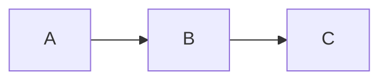

# 見出し H1 タイトル（日本語）Title

## 見出し H2  ABCdef 12345  illillil WWWMMM

通常の段落。日本語と English mixed、約物「」（）・…—、絵文字 😀🚀✅、合字 fi ff →。

- [ ] 未チェック
- [x] 済み task

| 項目 | 値 | 説明（日本語の列幅テスト） |
| --- | --- | --- |
| iPhone 同期 | 高 | あいうえおかきくけこ |
| WWWWW | 低 | iiiii lllll |

$E = mc^2$ と $$\int_0^1 x^2\,dx = \frac{1}{3}$$

> 引用ブロック。コード `inline code` も確認。
