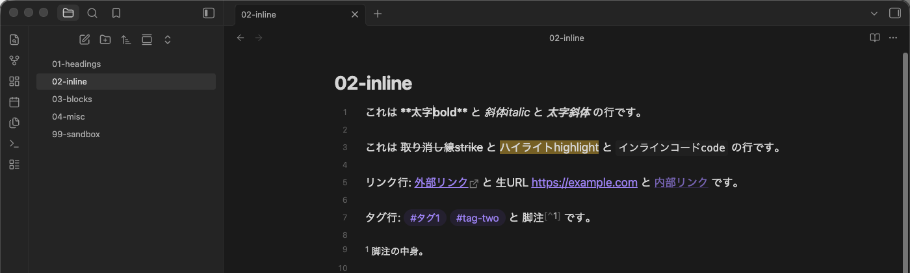
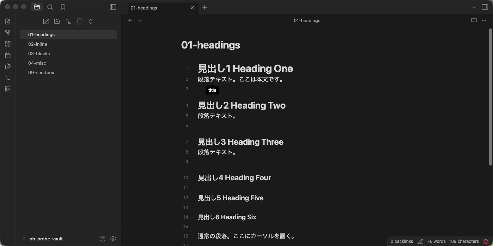

# Obsidian Live Preview 実測仕様書

**対象**: Obsidian 1.13.4 (macOS / Electron 43.1.1 / Chrome 150)
**調査日**: 2026-08-05
**調査方法**: Obsidian を `--remote-debugging-port=9222` で起動し、Playwright の
`chromium.connectOverCDP()` でレンダラプロセスへ接続。`app.workspace.getActiveFileView().editor.cm`
（CodeMirror 6 の EditorView）を直接操作してカーソルを1文字ずつ動かし、
そのつど `.cm-content` の DOM 全体をダンプして「どの位置にカーソルがあるとき、どの記法が
生テキストに戻るか」を総当たりで記録した。キー操作は Playwright の
`page.keyboard` による**実キーイベント**で発火させ、押下後の `state.doc` と
`state.selection` を読み出した。

> この文書は**観測結果のみ**を書く。我々が何を作るかは
> [requirements.md](requirements.md)、どう作るかは [architecture.md](architecture.md) を参照。

---

## 0. 用語

| 用語 | 意味 |
|---|---|
| **収縮**（collapsed） | 記法文字が画面から消え、装飾された見た目になっている状態 |
| **展開**（expanded / reveal） | 記法文字が生の Markdown として画面に戻っている状態 |
| **トークン** | 1つの記法要素が占めるソース上の範囲。`**太字**` なら `**` を含む全体 |
| `from` / `to` | トークンのソース開始オフセット / 終了オフセット（`to` は最後の文字の**次**） |

Obsidian の編集ビューには2つのモードがある。本書が対象とするのは前者。

- **Live Preview**: `view.getState() === { mode: 'source', source: false }`
- **Source mode**: `{ mode: 'source', source: true }`（記法をいっさい隠さない生表示）
- （**Reading view**: `{ mode: 'preview' }` は編集不可の閲覧専用ビュー。⌘E で編集ビューと交互に切り替わる）

---

## 1. 大原則（これが全ての土台）

### 原則1: ドキュメントは常に生の Markdown テキストそのもの

Obsidian の Live Preview は「Markdown を別のドキュメントモデルへ変換して編集し、
保存時に Markdown へ書き戻す」方式では**ない**。CodeMirror 6 のドキュメントは
ファイルの中身そのままの文字列で、表示だけを decoration で差し替えている。

観測による裏付け:

- `cm.state.doc.toString()` は常にファイルの中身と1文字も違わない。
- 収縮表示中でも、カーソルのオフセットは生テキストのオフセットのまま。
  `- 項目1` の行で `End` を押すと `C5`（`- 項目1` の実長）に行く。
- 全選択してコピーすると、クリップボードには**生 Markdown がそのまま**入る。
  表のパイプ記法も含めて完全一致した。

```
入力: '# 見出し\n\n- **太字**の項目\n\n| A | B |\n| --- | --- |\n| 1 | 2 |\n'
⌘A ⌘C 後のクリップボード:
     '# 見出し\n\n- **太字**の項目\n\n| A | B |\n| --- | --- |\n| 1 | 2 |\n'
```

**帰結**: 記法の展開/収縮でカーソル位置がズレる、往復変換で記法が壊れる、
という問題が原理的に発生しない。

### 原則2: 展開スコープは要素ごとに4種類ある

| スコープ | 意味 | 該当要素 |
|---|---|---|
| **トークン** | カーソルがそのトークンの範囲 `[from, to]`（**両端を含む**）にあるときだけ展開 | インライン記法全般、チェックボックス |
| **行** | カーソルがその行のどこにあっても展開 | 見出し、水平線、脚注定義、エスケープ |
| **ブロック** | カーソルがその複数行ブロックのどこかにあれば、ブロック全体を展開 | コールアウト、コードフェンス、数式ブロック |
| **常時変換** | カーソル位置に関係なく**絶対に展開しない** | 箇条書きの `-`、引用の `>`、表、frontmatter |

トークンスコープの境界は実測で厳密に確認した。`これは **太字bold** と *斜体italic* と ***太字斜体*** の行です。`
という行で、カーソルオフセットを 0 から順に動かしたときの表示の変化点:

| トークン | ソース範囲 | 展開されるカーソル位置 | 収縮に戻る位置 |
|---|---|---|---|
| `**太字bold**` | `[4, 14)` | **4 〜 14**（両端含む） | 15 |
| `*斜体italic*` | `[17, 27)` | **17 〜 27** | 28 |
| `***太字斜体***` | `[30, 40)` | **30 〜 40** | 41 |

つまり判定式は `from <= cursor <= to`。**トークンの直前（`from - 1`）では展開せず、
トークンの直後（`to`）では展開する**。閉じ記号を打ち終わった直後もまだ展開状態、
という自然な編集感になる。

同じ行の他のトークンは収縮したままである点が重要（下図。`**太字bold**` だけが展開し、
`斜体italic` と `太字斜体` は収縮を維持している）。



### 原則3: エディタが blur したら全部収縮する

`cm.contentDOM.blur()` した瞬間、展開されていた記法はすべて収縮に戻る。
カーソル（選択範囲）自体は保持されるが、表示は完全な閲覧状態になる。

```
フォーカスあり・カーソル L1:C2 → '# 見出し1 Heading One'
blur 後                        → '見出し1 Heading One'
```

### 原則4: 選択範囲は「触れている要素すべて」を展開する

選択が複数行にまたがる場合、またいだ行・トークンはすべて展開される。

```
L1(# 見出し1) の C5 から L4(## 見出し2) の C5 まで選択
→ L1: '# 見出し1 Heading One'   （展開）
→ L4: '## 見出し2 Heading Two'  （展開）
```

---

## 2. 要素別マトリクス

`収縮時の DOM` 列は `.cm-content` 直下要素の textContent（実測値）。

### 2.1 見出し

| 記法 | 行クラス | 収縮時の表示 | 展開スコープ |
|---|---|---|---|
| `# 〜 ###### ` | `HyperMD-header HyperMD-header-N` | `# ` を DOM から除去。**フォントサイズ・太さは見出しのまま** | **行** |

- カーソルがその行にある限り、行内のどのオフセットでも `# ` が出る（オフセット 0〜行末まで
  全走査して変化点が1つも無いことを確認）。
- `# ` を消しても見出しの装飾は残るので、**展開しても行の高さは変わらない**（横方向にだけ
  `# ` の幅ぶんずれる）。



### 2.2 インライン記法（すべてトークンスコープ）

| 記法 | 収縮時 | 備考 |
|---|---|---|
| `**太字**` | `太字` | マーカーは展開時も太字スタイルのまま薄く表示される |
| `*斜体*` | `斜体` | |
| `***太字斜体***` | `太字斜体` | |
| `~~取り消し線~~` | `取り消し線` | |
| `==ハイライト==` | `ハイライト` | 背景色付き |
| `` `コード` `` | `コード` | 等幅 + 背景色 |
| `$a^2+b^2=c^2$` | KaTeX ウィジェットに置換（textContent は空） | 展開範囲 `[8,25]` を実測 |
| `[表示](URL)` | `表示` のみ。リンク色 + 外部リンクアイコン | URL 部分ごと消える |
| `[[内部リンク]]` | `内部リンク` | |
| `` | `` ウィジェットに置換 | |
| `![[埋め込み.png]]` | 埋め込みウィジェット（未解決なら "could not be found" 表示） | |

**展開しない（常に生テキストのまま装飾だけ付く）インライン要素**:

| 記法 | 挙動 |
|---|---|
| 生URL `https://example.com` | そのまま表示され自動リンク化。記法文字が無いので展開の概念が無い |
| タグ `#タグ1` | `#` 込みでそのまま表示。バッジ状の装飾のみ |
| 脚注参照 `[^1]` | `[^1]` のまま上付き装飾 |
| コメント `%%コメント%%` | Live Preview では**隠されない**（Reading view でのみ消える） |

**行スコープのインライン要素**:

| 記法 | 収縮時 | 展開スコープ |
|---|---|---|
| エスケープ `\*ほし\*` | `*ほし*`（`\` が消える） | **行**（トークンに触れていなくても行にカーソルがあれば `\` が出る） |
| 脚注定義 `[^1]: 脚注の中身。` | `1 脚注の中身。` | **行** |

### 2.3 リスト（常時変換 — 絶対に展開しない）

```html
<!-- カーソルが行にあってもなくても、DOM はこれで固定 -->
<span class="cm-formatting cm-formatting-list cm-formatting-list-ul cm-list-1">
  <span class="list-bullet">-</span>&nbsp;
</span><span class="cm-list-1">箇条書き1</span>
```

- `-` の文字は **DOM から消さない**。`.list-bullet` に `color: rgba(0,0,0,0)`（透明）を当て、
  `::after` の擬似要素で `•` を描画している。幅は 8px を占有する。
- したがって**カーソルは `-` の上を普通に通過でき、桁位置はソースと 1:1** のまま。
- 番号リスト `1. ` は数字そのものが表示物なので、そのまま表示（`.cm-formatting-list-ol`）。
- ネストは行クラス `HyperMD-list-line-1/2/3` で表現。インデントは2スペースでも4スペースでも認識する。

### 2.4 チェックボックス（トークンスコープ）

| カーソル位置 | 表示 |
|---|---|
| `- [ ] 未チェック項目` のオフセット **0〜5** | 生テキスト `- [ ] 未チェック項目` |
| オフセット **6 以降** | `<input type="checkbox" class="task-list-item-checkbox">` ウィジェット + ` 未チェック項目` |

- `- [ ]` の5文字が1つの置換トークン（`[from, to] = [0, 5]`）。インライン記法と同じ境界規則。
- レンダリング済みチェックボックスを**クリックするとソースの `[x]`↔`[ ]` が書き換わる**。
- チェック済み `- [x]` の行は本文に打ち消し線スタイルが付く。

### 2.5 引用（常時変換 — 展開しない）

```html
<span class="cm-formatting cm-formatting-quote cm-formatting-quote-1 cm-quote cm-quote-1">
  <span class="cm-transparent">&gt;</span>&nbsp;
</span><span class="cm-quote cm-quote-1">引用の1行目</span>
```

- `>` は `.cm-transparent` で透明化。リストと同じく**文字は残り幅も占有する**。
- 左側の縦罫線は行の装飾（`HyperMD-quote-N`）。
- 多重引用 `>> ` は `HyperMD-quote-2` になり、`>` ごとに span が分かれる。

### 2.6 コールアウト（ブロックスコープ）

| カーソル | DOM |
|---|---|
| ブロック外 | `<div class="cm-embed-block cm-callout">` **1要素**が2行ぶんを置換 |
| ブロック内のどこか | 通常の引用行に展開: `> [!note] コールアウト見出し` / `> コールアウト本文です。` |

上から `ArrowDown` で入ると、ウィジェットが展開されて**先頭行の C0** に着地する。

### 2.7 コードフェンス（ブロックスコープ・ただしウィジェット化はしない）

```
```js            ← 収縮時は言語ラベル "JavaScript" だけが表示される（右上に配置）
const a = 1;     ← 本文は常に生テキスト + シンタックスハイライト
console.log(a);
```              ← 収縮時は空表示（高さは残る）
```

- 行クラス: `HyperMD-codeblock-begin` / `HyperMD-codeblock-bg` / `HyperMD-codeblock-end`。
- **本文行にカーソルを置くだけで開始・終了フェンスの両方が生テキストに戻る**
  （ブロック全体が1つの展開単位）。
- コードブロック内の `Tab` は**タブ文字を挿入**する（インデント操作にはならない）。
- ` ```js ` と打って `Enter` すると**閉じフェンスが自動挿入**される:
  `'```js'` + Enter → `'```js\n\n```'`。

### 2.8 表（常時変換 — 展開しない・セル内で直接編集）

| カーソル | DOM |
|---|---|
| 表の外 | `<div class="cm-embed-block cm-table-widget markdown-rendered">`（実 `<table>`） |
| 表の行の中 | **ウィジェットのまま**。カーソルのあるセルだけが編集可能セルになる |

- 上から `ArrowDown` で入ると `L3:C2`（先頭セルの本文先頭）に着地する。
  ソースのパイプ記法が生表示に戻ることは一度も無い。
- **表に入ると Obsidian がソースを整形する**。`| 列A | 列B |` が `| 列A  | 列B  |` に
  書き換わった（列幅を揃えるパディング）。

### 2.9 水平線（行スコープ）

| カーソル | DOM |
|---|---|
| 他の行 | `<div class="hr cm-line">`（罫線ウィジェット、textContent は空） |
| その行 | `<div class="cm-line HyperMD-hr HyperMD-hr-bg">---</div>` |

`Backspace` は普通に1文字消える（`---` → `--`）。特別な記法解除は無い。

### 2.10 数式ブロック（ブロックスコープ）

| カーソル | DOM |
|---|---|
| ブロック外 | `<div class="math math-block cm-embed-block">` 1要素が `$$`〜`$$` の3行を置換 |
| ブロック内 | `$$` / `E=mc^2` / `$$` の3行に展開され、**その下に描画結果のウィジェットも残る** |

展開中は「生テキスト3行 + 描画結果」が縦に並ぶ（編集しながら結果を見られる）。

### 2.11 frontmatter（常時変換・カーソル侵入不可）

- `---` 〜 `---` のブロックは**プロパティパネル**（`.metadata-container`）に完全置換される。
- `cm.dispatch()` で frontmatter 内へカーソルを設定しても、実際のカーソルはブロックの
  外側へ弾かれた。Live Preview では生の YAML を直接編集できない。

---

## 3. カーソル移動の実測

### 3.1 隠れた記法の上をどう通過するか

**結論: 一切スキップしない。1文字ずつ通過し、通過した瞬間に展開される。**

| 操作 | 結果 |
|---|---|
| `本文\n# 見出し` の L1:C2（行末）から `→` 3回 | L2:C0 → L2:C1 → L2:C2（`#` と ` ` の上をそれぞれ通過） |
| `# 見出し` の L2:C0 から `←` | L1:C2（前の行の末尾へ） |
| `本文テキスト` L1:C3 から `↓` | L2:C4（視覚的な列位置を維持して着地） |
| `ab **cd** ef` の C2 から `→` 3回 | C3 → C4 → C5（`*`,`*` を1つずつ通過） |
| `x  y` の C1 から `→` 3回 | C2 → C3 → C4（画像ウィジェットの中の `!`,`[` を通過） |

CodeMirror の `atomicRanges` によるスキップは使っていない。
「カーソルが入る → 展開される → 生テキストとして普通に動ける」という一貫した挙動。

### 3.2 クリック位置 → ソースオフセットの対応

収縮表示された `これは **太字bold** です。` の、レンダリング済み `太字bold` の**中央**を
クリックした結果:

```
クリック直前の表示: 'これは 太字bold です。'
クリック直後の表示: 'これは **太字bold** です。'   ← 展開された
カーソル位置:       L3:C8                        ← '太字' と 'bold' の境目（ソース基準で正しい）
```

**展開でテキストが右にずれても、カーソルは意味的に正しい文字の位置に着地する**。
（クリック地点の解決 → カーソル設定 → 展開、の順に起きている）

### 3.3 Home / End

| 行 | 操作 | 結果 |
|---|---|---|
| `- 項目1` | `Home` | **C2**（`- ` の後ろ = 本文先頭） |
| `- 項目1` | `Home` をもう一度 | **C0**（行の物理的な先頭） |
| `- 項目1` | `End` | C5（行末） |
| `# 見出し` | `Home` | **C0**（見出しには「本文先頭」の停止は無い） |

**スマートホームはリスト系のみ**。見出しや引用では素直に C0 へ行く。

---

## 4. キー操作の実測

`before` は初期テキスト、`after` は操作後の `state.doc` 全体。

### 4.1 Enter

| 状況 | before | after | カーソル |
|---|---|---|---|
| リスト項目の行末 | `- 項目1` | `- 項目1\n- ` | L2:C2 |
| リスト項目の途中 (C3) | `- 項目1` | `- 項\n- 目1` | L2:C2 |
| **空のリスト項目** | `- 項目1\n- ` | `- 項目1\n` | L2:C0（マーカー削除、行は増えない） |
| 番号リストの行末 | `1. 番号1` | `1. 番号1\n2. ` | L2:C3（**自動採番**） |
| **空の番号リスト** | `1. 番号1\n2. ` | `1. 番号1\n` | L2:C0 |
| 未チェック項目の行末 | `- [ ] タスク` | `- [ ] タスク\n- [ ] ` | L2:C6 |
| **チェック済み項目の行末** | `- [x] 済み` | `- [x] 済み\n- [ ] ` | L2:C6（**新項目は未チェック**） |
| 引用行の行末 | `> 引用` | `> 引用\n> ` | L2:C2 |
| 空の引用行 | `> 引用\n> ` | `> 引用\n\n\n` | L3:C0 |
| **見出しの行末** | `# 見出し` | `# 見出し\n` | L2:C0（**プレフィックスを引き継がない**） |
| コードブロック内 | `` ```js\nconst a=1;\n``` `` | 素直に分割 | — |

### 4.2 Backspace — 記法解除は**しない**

これは Obsidian の特徴的な選択で、他の WYSIWYG エディタと大きく違う点。

| 状況 | before | after |
|---|---|---|
| リスト本文の先頭 (C2) | `- 項目1` | `-項目1` |
| チェックボックス本文の先頭 (C6) | `- [ ] タスク` | `- [ ]タスク` |
| 見出し本文の先頭 (C2) | `# 見出し` | `#見出し` |
| 引用本文の先頭 (C2) | `> 引用` | `>引用` |
| 水平線の行 | `---` | `--` |

**すべて素の1文字削除**。「見出しを段落に戻す」「リストを解除する」といった
インテリジェントな挙動は Backspace には割り当てられていない
（`Enter` on 空リスト項目 だけが例外的にマーカーを消す）。

### 4.3 Tab / Shift+Tab

| 状況 | before | after |
|---|---|---|
| リスト項目で `Tab` | `- 項目1\n- 項目2` | `- 項目1\n\t- 項目2`（**タブ文字**を挿入） |
| ネスト項目で `Shift+Tab` | `- 項目1\n    - 項目2` | `- 項目1\n- 項目2` |
| 2項目を選択して `Tab` | `- 親\n- 子1\n- 子2` | `- 親\n\t- 子1\n\t- 子2`（選択行すべて） |
| コードブロック内で `Tab` | `const a=1;` | `\tconst a=1;`（**ただの文字挿入**） |

インデント文字は vault 設定 `useTab` に従う（既定はタブ）。

### 4.4 自動ペア・囲み

| 入力 | カーソルなし選択 | 選択あり (`abc` を選択) |
|---|---|---|
| `[` | `ab[]`（**閉じ括弧を自動挿入**） | `[abc]`（**囲む**） |
| `(` | `ab()` | — |
| `` ` `` | `ab\``（自動ペアしない） | — |
| `*` | `ab*`（自動ペアしない） | `*abc*`（**囲む**） |
| `"` | `ab"`（自動ペアしない） | — |

### 4.5 書式トグル

| 操作 | before | after | 選択の扱い |
|---|---|---|---|
| `⌘B`（`abc` 選択） | `abc def` | `**abc** def` | 選択は `abc` のまま維持（C2〜C5） |
| `⌘I`（`abc` 選択） | `abc def` | `*abc* def` | 同上 |
| `⌘B`（`**abc**` の中 C3） | `**abc** def` | `abc def` | **解除**。カーソル C1 に補正 |

### 4.6 記法の入力による変換

Live Preview は「打った文字がそのままソース」なので、**変換処理は存在しない**。
`# ` と打てばその瞬間から見出し行として装飾されるだけ。

| 入力 | 結果 |
|---|---|
| 空行に `# 見出し` | `# 見出し`（見出し装飾が即座に付く） |
| 空行に `- 項目` | `- 項目` |
| 空行に `> 引用` | `> 引用` |
| リスト項目で `[] タスク` | `- [] タスク`（**`[ ]` への補正はしない**＝チェックボックスにならない） |
| ` ```js ` + Enter | `` ```js\n\n``` ``（閉じフェンスのみ自動補完） |

### 4.7 Undo

| 操作 | 結果 |
|---|---|
| `def` と3文字打って `⌘Z` | 3文字まとめて取り消し（`abc` に戻る） |
| リスト行末 `Enter` の後 `⌘Z` | 1ステップで元に戻る |

連続入力は1グループにまとめられる（CodeMirror 標準の history）。

---

## 5. 行番号ガター

`showLineNumber: true` のとき、行番号は**視覚行ではなくソース行番号**を表示するが、
**ウィジェットに畳まれたブロックの中間行は番号ごと省略される**。

```
ソース:
  1 段落1
  2
  3 | A | B |     ┐
  4 | --- | --- | ├ 表ウィジェット（1要素に畳まれる）
  5 | 1 | 2 |     ┘
  6
  7 段落2
  8
  9 > [!note] t   ┐ コールアウトウィジェット
 10 > b           ┘
 11
 12 段落3

実際のガター表示: 1, 2, 3, 6, 7, 8, 9, 11, 12
                        ↑4,5 が無い    ↑10 が無い
```

つまりガターは**視覚行に1対1で対応**し、畳まれたブロックはその**先頭のソース行番号**を
1つだけ表示する。

---

## 6. モード切替

| 操作 | 結果 |
|---|---|
| `⌘E` | Live Preview（`mode: 'source', source: false`）⇄ Reading view（`mode: 'preview'`） |
| 設定 | Source mode（`source: true`）は設定 or コマンドで切り替える別軸 |

---

## 7. 調査の再現手順

```bash
# 1) Obsidian を CDP 付きで起動
/Applications/Obsidian.app/Contents/MacOS/Obsidian --remote-debugging-port=9222 &

# 2) 接続確認
curl -s http://localhost:9222/json | python3 -m json.tool
```

接続後は Playwright の `chromium.connectOverCDP('http://localhost:9222')` で
`app://obsidian.md/index.html` のページを取り、以下で内部状態にアクセスできる。

```js
const view = window.app.workspace.getActiveFileView();
const cm = view.editor.cm;              // CodeMirror 6 EditorView
cm.state.doc.toString();                // 生 Markdown
cm.dispatch({ selection: { anchor: n } });
document.querySelectorAll('.cm-content > *');  // 描画結果
```

調査に使ったプローブスクリプト群は本リポジトリには含めていない（一時 vault 上で実行した）。
再調査するときは上記の手順で同じことができる。

---

## 8. 我々の現行 Preview との差分（要点）

| 論点 | Obsidian | 現行 markdown-inline-preview |
|---|---|---|
| ドキュメントモデル | 生 Markdown 文字列（CM6） | ProseMirror ドキュメント（Milkdown）＋往復変換 |
| 記法の展開 | カーソル位置で展開/収縮する | **廃止した**（常時実テキスト表示） |
| 展開の粒度 | トークン / 行 / ブロック / 常時変換の4種 | — |
| 行頭 Backspace | ただの1文字削除 | 記法解除（見出し降格・リスト解除） |
| リストの `-` | 透明化して残す（桁が1:1） | — |
| 表 | 常にレンダリング、セル内で直接編集 | — |
| 行番号 | 視覚行に1対1（畳まれた行は番号ごと省略） | ソース行に1対1 |

直近のコミット `4af4491`（フォーカス展開の廃止）は Obsidian の挙動とは**逆方向**の決定である。
Live モードは既存 Preview を変更せず、別モードとして Obsidian 側の思想を実装する。
